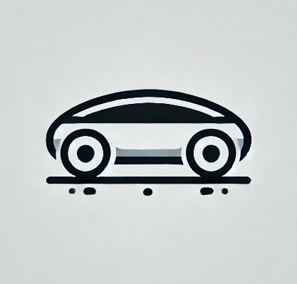

  

# **UNDER**  
_Urban Navigation for Driverless and Excellent Routing_
---
## 🚀 **Inspiration**  
Efficient vehicle scheduling is critical to improving customer satisfaction and optimizing resource utilization in urban environments. Inspired by the challenges of real-world routing in busy cities, we set out to create a tool that ensures fast and reliable vehicle scheduling using advanced computational algorithms.

---

## 🛠️ **What It Does**  
UNDER leverages a **Constraint Programming SAT (CP-SAT)** algorithm to:  
- Schedule vehicles in a predefined environment with optimal efficiency.  
- Minimize delays and ensure timely operations.  
- Adapt to dynamic routing scenarios in urban areas.  

---

## 🧑‍💻 **How We Built It**  
We combined cutting-edge technologies and tools to bring UNDER to life:  
- **Python**: For backend logic and CP-SAT implementation.  
- **OR-Tools**: To handle constraint-solving and optimization.  
- **Socket.IO**: For real-time communication between the backend and frontend.  
- **React**: To create an interactive and responsive user interface.  
- **OpenRouteService**: For accurate routing and geolocation services.  
- **Leaflet**: To visualize maps and vehicle paths seamlessly.  

---

## 🌟 **Accomplishments We're Proud Of**  
- **Speed and Reliability**: Achieved highly optimized scheduling with statistically significant improvements in efficiency.  
- **Scalable Design**: Built a flexible system capable of handling diverse routing challenges.  
- **User-Friendly Interface**: Developed an intuitive interface for seamless interaction and visualization.  

-------

Made with ❤️ for smarter urban navigation 🚗

